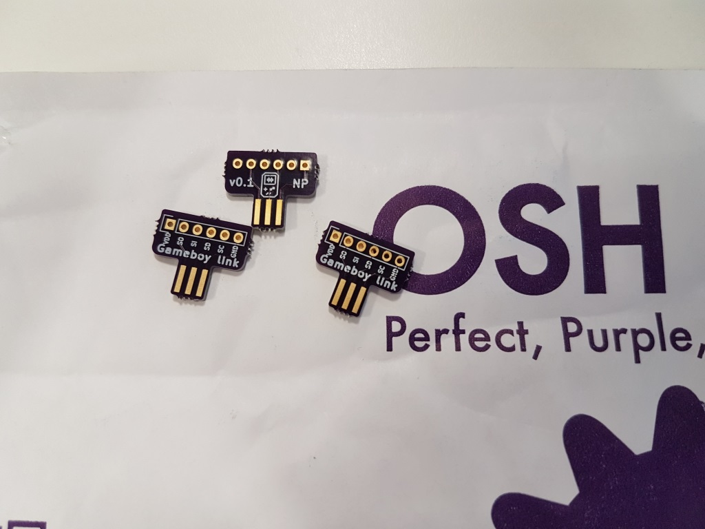

# Gameboy Link Cable Breakout PCB

<a href="https://oshpark.com/shared_projects/srSgm3Yj"></img></a>

I have been thinking about interfacing with my gameboy for a while via the link cable but had no way, other than destroying a cable, to connect it to an arduino or raspberry pi.

Eventually I stumbled upon [a blog post where someone had written about the creation of a link cable breakout board](http://obskyr.io/lanette/devlog/making-a-game-boy-link-cable-breakout-board/). Unfortunately they didn't distribute their CAD file but I figured now would be a good time for me to learn how to create a PCB too.

This is my result, it's very basic but after sending the gerbers to OSHPark I got some boards back which work great.

More about how I made it can be found on my blog: http://www.palmr.co.uk/blog/26/Game+Boy+Link+Cable+Breakout+Board
